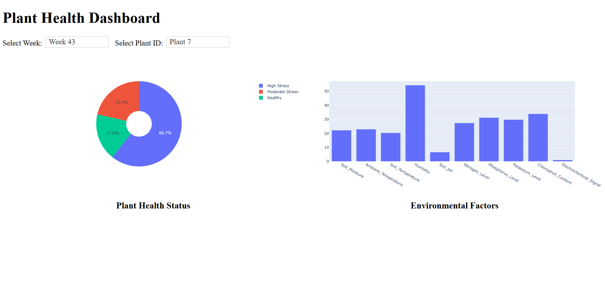

# 🌱 Plant Health Analytics Project

## **Overview**
This project aims to develop an end-to-end data pipeline that enables efficient monitoring of plant health using IoT sensor data, AI/ML analytics, and a web-based dashboard for visualization. The system automates data ingestion, processing, and deployment to provide real-time insights into plant health and environmental factors.

  

## Problem Statement

The **Plant Health Analytics Project** addresses the critical problem of monitoring plant health in agricultural environments. As agriculture becomes increasingly reliant on technology, there is a growing need to efficiently track and manage plant health. IoT (Internet of Things) sensors play a key role in collecting real-time environmental data from fields or greenhouses, which provides valuable insights into plant health. This data includes measurements such as temperature, humidity, soil moisture, nitrogen levels, and other key environmental factors.

### Key Problems Addressed:
1. **Inability to Monitor Plant Health Continuously:** Traditional plant health monitoring is labor-intensive and time-consuming. Farmers or researchers may not have the resources or time to manually check each plant's condition.
   
2. **Lack of Real-time Insights:** Without real-time data, plant health can degrade before timely intervention can be made. This can lead to reduced crop yields, inefficient use of resources (e.g., water, fertilizers), and potentially catastrophic losses.
   
3. **Data Overload:** While the sensor data is valuable, manually analyzing large volumes of data from multiple sources can overwhelm users. It becomes crucial to automate data processing, cleaning, and analysis to provide actionable insights efficiently.

## Solution Provided:
The **Plant Health Analytics Project** utilizes a comprehensive, cloud-based system that collects and processes IoT sensor data for plant health monitoring. The solution provides the following features:

1. **Automated Data Collection and Processing:**
   - **IoT Sensors:** The project leverages IoT sensors to gather environmental data continuously from the plants. These sensors measure factors such as temperature, humidity, soil moisture, and nitrogen levels at different times throughout the day (e.g., morning, afternoon, evening, and night).
   - **Automated Data Pipeline:** Using Apache Airflow, an automated pipeline ingests, cleans, and transforms this data, reducing the need for manual processing. The pipeline ensures that the data is updated regularly, ensuring the system is always working with the latest information.

2. **Cloud-Based Dashboard for Visualization:**
   - **BigQuery and Cloud Storage:** The processed data is stored in **Google BigQuery**, enabling fast, scalable querying and analysis. Raw data is initially stored in **Google Cloud Storage (GCS)**, and after cleaning and transformation, it’s loaded into BigQuery for further analysis.
   - **Interactive Web Dashboard:** The solution offers a user-friendly, **cloud-based dashboard** built with **Dash (Plotly)**, which provides interactive visualizations. The dashboard displays insights such as plant health status, environmental factors impacting plant health, and trends over time. Users can filter data by time periods or specific plant IDs, allowing them to monitor and make informed decisions.
   
3. **Actionable Insights:**
   - **Health Status Tracking:** The system categorizes plants into different health statuses, such as **Healthy**, **Moderate Stress**, or **High Stress**, based on sensor data. This allows users to track the overall health of their plants and detect problems early.
   - **Predictive Analytics (Future Scope):** By incorporating machine learning (ML) models, the system can provide **predictive insights** into potential future plant health issues, enabling proactive intervention.

4. **Scalability and Flexibility:**
   - The system is designed to scale for use in small-scale farms as well as large agricultural operations. The cloud-based architecture ensures that it can handle large volumes of data and multiple plant locations without compromising performance.

## Benefits:
- **Real-time Monitoring:** Farmers, researchers, or plant managers can monitor plant health in real time, reducing the likelihood of plant deterioration before intervention.
- **Improved Decision Making:** With data-driven insights, decisions on irrigation, fertilization, pest control, and other key agricultural practices can be made more effectively and with greater precision.
- **Increased Crop Yields:** Timely interventions based on accurate data can lead to healthier plants and ultimately higher crop yields.
- **Resource Efficiency:** The system enables efficient use of resources, as data can indicate when and where intervention is required, reducing waste.

By automating the monitoring process and presenting actionable insights through a cloud-based dashboard, this project aims to improve plant health management while increasing overall productivity and sustainability in agriculture.

## **Key Features**
✅ **Automated Data Pipeline** → Ingests, cleans, and transforms plant health data.  
✅ **Cloud-Based Storage & Processing** → Utilizes **Google Cloud Storage (GCS)** and **BigQuery**.  
✅ **Interactive Dashboard** → Built with **Dash (Plotly)**, deployed on **Cloud Run**.  
✅ **CI/CD Workflow** → Uses **Cloud Build & Docker** for automated deployments.  
✅ **Airflow Orchestration** → **Cloud Composer (Airflow)** manages scheduled data workflows.

## **Project Workflow**
1️⃣ **Ingestion** → Collects daily sensor data (CSV) and stores it in **GCS**.  
2️⃣ **Processing** → Cleans, transforms, and loads structured data into **BigQuery**.  
3️⃣ **Visualization** → The **Dash-based dashboard** fetches data from **BigQuery**.  
4️⃣ **Deployment** → Uses **Cloud Run** for public access and **Cloud Build** for CI/CD.

For detailed architectural understanding, refer to [Architecture](docs/architecture.md).

## **Tech Stack**
- **Data Processing** → Pandas, PyArrow, BigQuery
- **Cloud Infrastructure** → GCS, BigQuery, Cloud Composer (Airflow)
- **Web Dashboard** → Dash (Plotly), Flask
- **Deployment** → Cloud Run, Docker, Cloud Build, IAM
- **Monitoring & Logging** → Cloud Logging, Cloud Monitoring
- **Infrastructure as Code** → Terraform

For detailed tech stack information, refer to [Tech Stack](docs/tech_stack.md).

## **Deployment Instructions**
For detailed deployment steps, refer to [Deployment Guide](docs/deployment_guide.md).

## **Future Enhancements**
✔️ **Real-Time Data Processing** → Integrate **Pub/Sub + Dataflow**.  
✔️ **Machine Learning Integration** → Predict plant health trends using **Vertex AI**.  
✔️ **Enhanced Security** → Implement **API Gateway & IAP** for secure access.

**This project provides a scalable and automated system for plant health monitoring using cloud-based data analytics and visualization.**

## **Peer review guide**
The peer reviewers can refer to this guide for evaluation purpose [Peer review guide](docs/peer_review_guide.md).

## Data source 
Kaggle : https://www.kaggle.com/datasets/ziya07/plant-health-data

## Dashboard
Cloud build url is live at : https://plant-health-dashboard-703716144022.us-central1.run.app/

