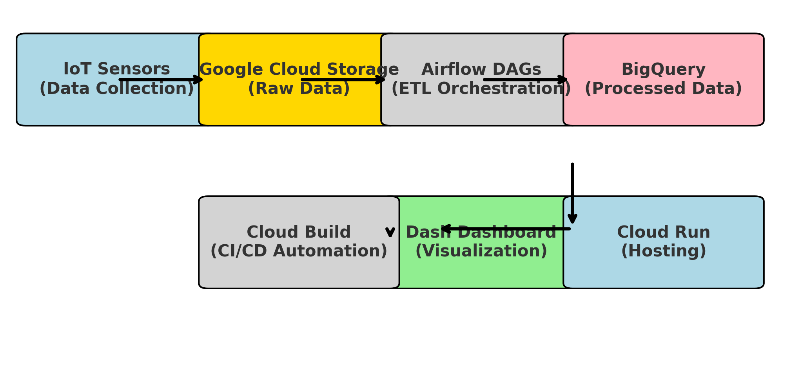

## Architecture Overview

This architecture outlines the end-to-end data flow from **IoT sensors** to the **Plant Health Dashboard**, deployed on **Google Cloud Platform (GCP)**.

  

---

### **1️⃣ Data Ingestion**
- IoT sensors collect **environmental data** (temperature, humidity, soil moisture, nitrogen levels, etc.).
- Data is stored in **CSV files** and uploaded to **Google Cloud Storage (GCS)**.
- The ingestion pipeline is triggered using **Apache Airflow (Cloud Composer)** to automate data movement.

---

### **2️⃣ Processing & Transformation**
- **Apache Airflow DAGs** orchestrate data processing workflows.
- Data is read from **GCS**, and transformations are applied using **Python (Pandas, PyArrow)**:
  - **Timestamp normalization** for consistent time formats.
  - **Data validation** to check for missing or corrupted values.
  - **Categorization of Plant Health Status** (Healthy, Moderate Stress, High Stress).
- The cleaned and transformed data is stored in **BigQuery** for efficient querying.

---

### **3️⃣ Analytics & Dashboard**
- The dashboard is built using **Dash (Plotly)** and fetches data **directly from BigQuery**.
- Key visualizations:
  - **Plant Health Distribution**: Pie chart showing healthy vs. stressed plants.
  - **Environmental Factors Affecting each Plant**: Bar chart showing temperature, humidity, soil conditions and other environmental factors for each plant.
- Interactive elements:
  - **Time Period Filter**: Users can select a particular week. 
  - **Plant Selection**: Users can select specific plants.

---

### **4️⃣ CI/CD & Deployment**
- **Cloud Build** automates the **Docker container build** and pushes it to **Artifact Registry**.
- The **Dash app is containerized** using **Docker** and deployed to **Cloud Run**.
- **IAM permissions** ensure:
  - The dashboard is publicly accessible.
  - Only authorized services (Airflow, BigQuery, Cloud Run) can interact securely.

---

### **5️⃣ Automation & Scalability**
- **Airflow DAGs run on a schedule (say, daily run)**, and dashboard is optimized for weekly viewing.
- The **Cloud Run service scales automatically** based on incoming user requests.
- Future scalability:
  - Can integrate **real-time streaming (Pub/Sub, Dataflow)** for instant sensor updates.
  - Extend **ML models** for predictive plant health analytics.

---

This architecture ensures **seamless, automated, and scalable** data processing and visualization, providing valuable insights into **plant health trends** for researchers and farmers.
