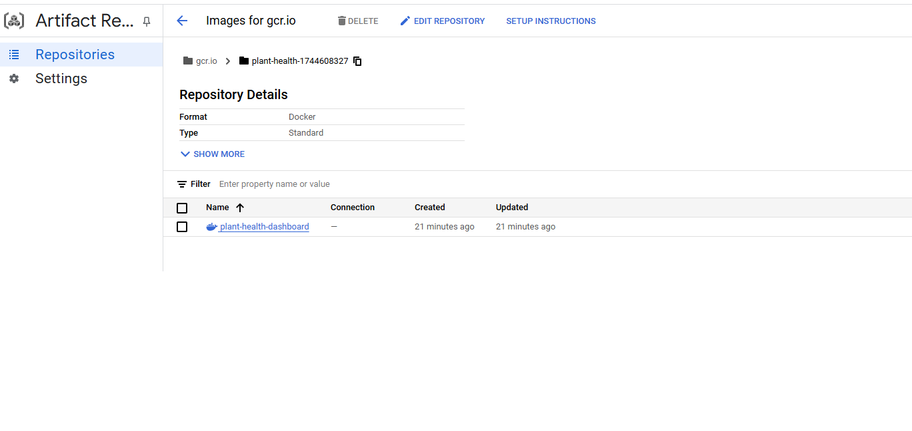

## 🚀 Deployment Guide for Plant Health Dashboard

The Plant Health Dashboard processes sensor data collected four times daily; say morning, afternoon, evening and night. This data is stored in the **DATA LAKE: Google Cloud Storage (GCS)**, where it is ingested and cleaned for weekly analysis (e.g., Week 46, 47, …), before being loaded into **DATA WAREHOUSE: BigQuery**. The **Airflow DAG** automates this ingestion, cleaning, and loading tasks through batch processing, ensuring that the dashboard reflects up-to-date plant health insights.

---

### **Final Automated Workflow**

✅ **Airflow DAG** processes new sensor data (Week 46, 47, …), cleans it, and loads it into **BigQuery**.  
✅ **Dockerized App** fetches data from **BigQuery** and is deployed to **Cloud Run** for public access.  
✅ **Cloud Build** automates the build and redeployment process, ensuring seamless updates.

---

### ☁️ GCP Project Setup (via Terraform)

#### **Prerequisite : Create a new GCP Project and enable billing account**

 Login to GCP:
   ```bash
   gcloud auth login
   ```

 Export Project ID and Name:
   ```bash
   export PROJECT_ID="plant-health-$(date +%s)"
   export PROJECT_NAME="Plant Health Dashboard"
   ```

**Create New GCP Project:**
   ```bash
   gcloud projects create $PROJECT_ID --name="$PROJECT_NAME" # Create Project
   gcloud config set project $PROJECT_ID # Set Active Project
   gcloud beta billing projects describe $PROJECT_ID # Check Billing Status
   gcloud beta billing projects link $PROJECT_ID --billing-account=YOUR_BILLING_ACCOUNT_ID # Link Billing Account
   gcloud beta billing projects describe $PROJECT_ID # Verify Billing Enabled
   ```
---

1. **Clone the Repository and Navigate to Infra Folder**
   ```bash
   cd plant-health-dashboard/infra
   ```

2. **Initialize Terraform**
   ```bash
   terraform init
   ```

3. **Review and Apply the Infrastructure Plan**
   ```bash
   terraform plan
   terraform apply # add project_id and region declared in variables.tf
   ```

This will:
- Enable required GCP APIs  
- Create a Cloud Storage bucket with `raw/` and `processed/` folders  
- Create a BigQuery dataset `plant_health_dataset`  
- Create the `plant_health` table with the appropriate schema (from `schemas/plant_health_schema.json`)

#### ✅ IAM Permissions
Also the following permissions are granted to the Cloud Composer and Cloud Build service accounts:
- **Storage Admin**
- **BigQuery Data Editor**
- **Cloud Run Admin**
- **Artifact Registry Writer**

 🔁 This replaces the need to manually configure your project, buckets, and datasets — and ensures reproducible infrastructure for all environments.

---

### ⚙️ Project Structure

```bash
plant-health-dashboard/
│
├── data/
│   └── raw/
│       └── plant_health_data.csv
│
├── infra/                     
│   ├── main.tf
│   ├── variables.tf
│   ├── terraform.tfvars
│   └── schemas/
│       └── plant_health_schema.json
│
├── src/
│   ├── automation/
│   │   ├── airflow_dag.py
│   │   ├── ingest_data.py
│   │   ├── clean_data.py
│   │   └── load_to_bigquery.py
│
├── dashboard/
│   ├── app.py
│   └── requirements.txt
│
├── Dockerfile
└── cloud_build.yaml
```


#### ✅ Optional Tools
These are helpful but optional for easier debugging and testing:
- [ ] **dbt** for additional SQL-based transformations (optional)
- [ ] **Looker Studio** for alternate visualization (optional)
- [ ] **VSCode / Jupyter** for local testing of scripts


---

### 🔁 Workflow Orchestration

The data pipeline is orchestrated using **Apache Airflow**, deployed on **Google Cloud Composer**. Below are the essential bash commands used to create the Composer environment, deploy DAGs and scripts, install dependencies, and configure variables.

To replicate this setup, follow these steps:

---

### 1️⃣ Create Cloud Composer Environment

```bash
export PROJECT_ID="your-gcp-project"
export REGION="your-region"
export ENV_NAME="plant-composer-env"

gcloud composer environments create $ENV_NAME \
    --location $REGION \
    --image-version composer-3-airflow-2.10.2-build.12 \
    --project $PROJECT_ID \
    --node-count 3 \
    --environment-size small
```
Note: It should take around 10-15 minutes for the composer environment creation

---

### 2️⃣ Deploy DAGs and Python Scripts

```bash
# Upload raw data
gsutil cp data/raw/plant_health_data.csv gs://your-gcs-bucket/raw_data/plant_health_data.csv

# Upload DAG from src folder
gcloud composer environments storage dags import --environment $ENV_NAME --location $REGION --source airflow_dag.py

# Upload ingestion + processing scripts from src folder
gcloud composer environments storage dags import --environment $ENV_NAME --location $REGION --source ingest_data.py
gcloud composer environments storage dags import --environment $ENV_NAME --location $REGION --source clean_data.py
gcloud composer environments storage dags import --environment $ENV_NAME --location $REGION --source load_to_bigquery.py
```

---

###  3️⃣ Set Airflow Variables (via UI Import Method)

Instead of setting variables one by one, you can upload a JSON file containing all Airflow variables at once:

#### 📄 Step 1: Create a JSON file locally  
Create a file named `airflow_variables.json` in your project root (or any folder) with the following contents:

```json
{
    "RAW_CSV_PATH": "gs://your-gcs-bucket/raw_data/plant_health_data.csv",
    "INGESTED_DATA_PATH": "gs://your-gcs-bucket/processed_data/ingested_data.csv",
    "PROCESSED_DATA_PATH": "gs://your-gcs-bucket/processed_data/cleaned_data.parquet",
    "BQ_TABLE_NAME": "your-gcp-project.dataset.table",
    "GCS_BUCKET_NAME": "gs://your-gcs-bucket",
    "GCP_PROJECT_ID": "your-gcp-project"
}
```

---

#### 🖥️ Step 2: Import via Airflow UI

1. Go to your **Cloud Composer Environment > Airflow UI**
2. Navigate to the **Admin** tab → **Variables**
3. Click on **"Import Variables"** (upper right corner)
4. Upload the `airflow_variables.json` file from your local folder

⚠️ Note: Ensure all paths and project IDs in the JSON are correct before uploading.


---

### 4️⃣ Trigger the Airflow DAG from Composer

```bash
# Trigger the DAG after verifying DAG ID
gcloud composer environments run $ENV_NAME \
  --location $REGION \
  dags trigger \
  -- plant_health_dag
```

🔍 *Note:* Replace `plant_health_dag` with the exact `dag_id` defined in your `airflow_dag.py` file.

To confirm available DAGs:

```bash
gcloud composer environments run $ENV_NAME \
  --location $REGION \
  dags list
```

📸 **Screenshots of Airflow Deployment in Google Cloud Console**

<p align="center">
  
</p>

<p align="center">
  
</p>

<p align="center">
  
</p>

- ✅ Composer environment successfully created  
- ✅ DAG deployed and visible in Airflow UI  
- ✅ DAG triggered and completed execution

---

#### 🪣 Data Lake (Google Cloud Storage)

The dataset downloaded from Kaggle and available in the data folder is manually uploaded to GCS bucket.

- GCS bucket structure with `/raw_data/` and `/processed_data/`  
- Uploaded CSV file visible in GCS

---

#### 🔄 Data Transformation (Python-based)

Data transformation is handled in the DAG using Python (via Pandas) for:

- Timestamp normalization  
- Null value handling  
- Categorization of plant health into “Healthy”, “Moderate Stress”, “High Stress”

📄 Example script: `clean_data.py`

---

#### 🗄️ Data Warehouse (BigQuery)

Cleaned data is loaded into BigQuery using the DAG.

- BigQuery table `plant_health` created  
- Table schema and sample rows visible in BigQuery UI

---

### 5️⃣ Deploying the Dashboard (CI/CD with Cloud Build)

```bash
# Navigate to the project root
# Submit build and deployment
gcloud builds submit --config cloud_build.yaml .
```
---

📸 **Screenshots**

<p align="center">
  
</p>

<p align="center">
  
</p>

- Cloud Build log showing successful image build and deployment  
- Cloud Run logs and service URL 

Visit the URL displayed in the Cloud Build logs

---
#### 📊 Data Visualization (Cloud Run + Dash)

The final processed data is visualized using a Dash app, deployed via Cloud Run. The app reads live from BigQuery and supports filters for:

- Time period (weekly)
- Plant selection

---

### 🌐 Live Dashboard

Your deployed dashboard is now available at:

```
https://plant-health-dashboard-xxxxxxxx-xxxxxx.run.app/
```

Current deployment is valid till google instance is active at:
https://plant-health-dashboard-615598820843.us-central1.run.app/


