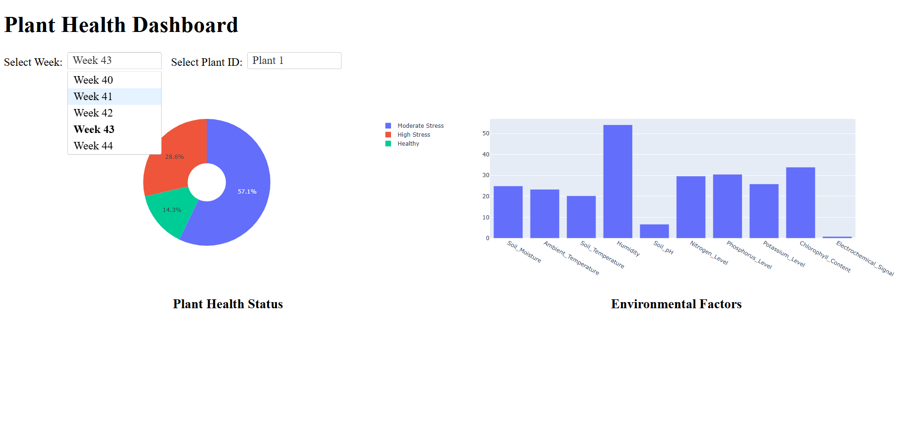
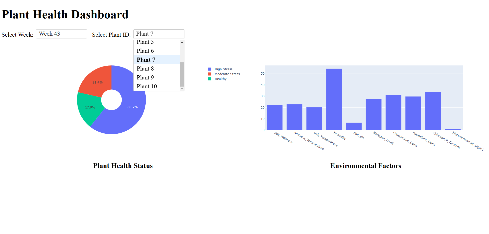

# **Peer Review Guide: Plant Health Analytics Project**

## **Evaluation Criteria and Project Assessment**

### **1. Problem Description**
**Score:** *4 points*
- The project addresses the problem of monitoring plant health using IoT sensor data.
- Provides automated insights on plant health based on environmental data.
- Offers a cloud-based dashboard for visualization and decision-making.

### **2. Cloud Usage**
**Score:** *4 points*
- The project is fully developed in the cloud using Google Cloud Platform (GCP).
- Infrastructure as Code (IaC) is implemented with Terraform for provisioning resources.

### **3. Data Ingestion**
#### **Batch / Workflow Orchestration**
**Score:** *4 points*
- Airflow DAGs orchestrate the entire pipeline from data ingestion to transformation and loading into BigQuery.
- Data is uploaded to a Google Cloud Storage (GCS) data lake before processing.

#### **Streaming (If applicable)**
**Score:** *0 points*
- The project currently does not implement real-time streaming systems.

### **4. Data Warehouse (BigQuery Usage)**
**Score:** *4 points*
- Data is stored in BigQuery and optimized using partitioning and clustering.
- Tables are structured to improve query efficiency, particularly for time-based queries.

### **5. Data Transformations**
**Score:** *2 points*
- SQL transformations are applied within BigQuery.
- No dbt or Spark transformations are currently implemented.

### **6. Dashboard**
**Score:** *4 points*
- A web-based dashboard is developed using Dash (Plotly) and deployed on Cloud Run.
- The dashboard has **two tiles**:
  1. **Plant Health Distribution** - Displays plant health status as a categorical distribution.
  2. **Environmental Factors** - Shows environmental conditions affecting plant health over time.

### **7. Reproducibility**
**Score:** *4 points*
- **README.md** and **deployment_guide.md** provide clear instructions to set up and run the project.
- The pipeline and dashboard can be reproduced using the provided Terraform, Airflow, and Docker configurations.

---

## **Instructions for Peer Reviewer**

### **1. Problem Description**
- Read the project README.md and confirm that the problem statement is clearly defined.
- Check if the solution aligns with the problem.

### **2. Cloud Usage**
- Verify Terraform scripts for infrastructure deployment.
- Confirm that cloud services such as GCS, BigQuery, Cloud Run, and Airflow are being used.

### **3. Data Ingestion**
- Check if Airflow DAGs automate data ingestion from GCS to BigQuery.
- Confirm data is stored in a structured format in the warehouse.

### **4. Data Warehouse**
- Verify that BigQuery tables are **partitioned and clustered** efficiently.
- Run sample queries to check if partitioning is utilized correctly.

### **5. Data Transformations**
- Check if transformations are implemented in BigQuery (SQL queries inside `move_to_bigquery.py`).
- Confirm if any dbt/Spark transformations are used (if applicable).

### **6. Dashboard**
- Open the Cloud Run dashboard URL and verify:
  - It loads correctly.
  - Both tiles are functional and display meaningful data.
  - Dropdown filters (time period & plant id selection) work as expected.

  

    
  

  

  

    
  

  

### **7. Reproducibility**
- Follow the provided **setup instructions** in the documentation.
- Deploy the pipeline and confirm that it works end-to-end.

---

## **Final Review Checklist**
✅ Problem statement is clearly defined.  
✅ Cloud resources (GCP, Terraform) are used.  
✅ Data ingestion is fully automated with Airflow.  
✅ BigQuery tables are structured for efficient querying.  
✅ Dashboard contains **two functional tiles**.  
✅ Instructions are clear for running the project.  

> **Note for Reviewer:** If any of these points are missing or unclear, please provide feedback to improve the documentation or implementation.

