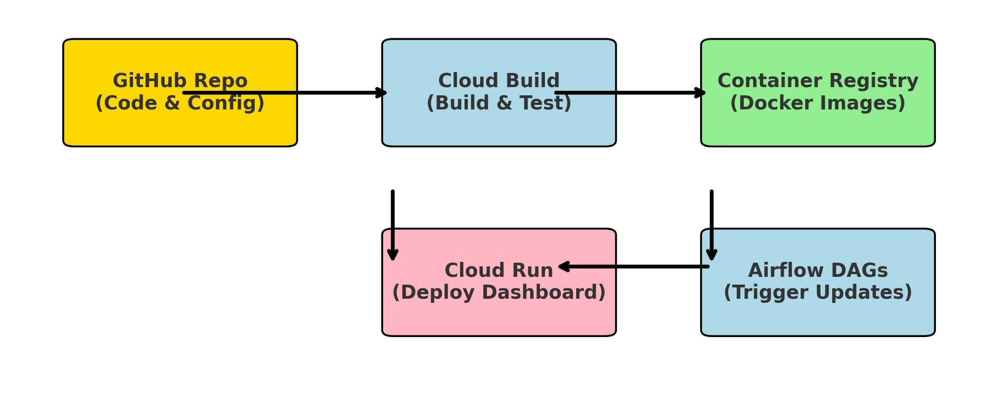

# **📌 Tech Stack for Plant Health Dashboard**  

## **1️⃣ Data Ingestion & Processing**  
The project ingests environmental sensor data in **CSV format**, processes it, and loads it into **BigQuery**.  

- **DATA LAKE: Google Cloud Storage (GCS)** → Stores raw and processed data.  
- **ETL: Pandas & PyArrow** → Data processing, cleaning, and transformation.  
- **DATA WAREHOUSE: BigQuery** → Stores structured plant health data for analysis.  
- **WORKFLOW ORCHESTRATION: Apache Airflow (Cloud Composer)** → Orchestrates ingestion, cleaning, and loading tasks.  

---

## **2️⃣ Dashboard Development**  
The dashboard provides real-time insights into plant health.  

- **Dash (Plotly)** → Python-based web dashboard framework.  
- **Flask** → Backend API serving dashboard requests.  
- **BigQuery Python Client** → Fetches processed data for visualization.  
- **Docker** → Containerizes the dashboard for deployment.  

---

## **3️⃣ Cloud Deployment & Automation**  
The project follows a **CI/CD pipeline** to automate deployment.  

- **Cloud Run** → Serverless deployment for the Dash app.  
- **Cloud Build** → Automates Docker image building and deployment.  
- **Artifact Registry** → Stores Docker images for Cloud Run deployment.  
- **IAM (Identity & Access Management)** → Secure access control for GCP services.  

---

## **4️⃣ Infrastructure as Code**  
To automate cloud resource provisioning.  

- **Terraform** → Defines and provisions GCP resources (e.g., storage, IAM, Cloud Run).  

---

## **5️⃣ Monitoring & Logging**  
Ensures smooth operation and debugging.  

- **Google Cloud Logging** → Captures logs from Airflow, Cloud Run, and Cloud Build.  
- **Google Cloud Monitoring** → Tracks system performance and alerts.  

---

## **6️⃣ Version Control & Collaboration**  
- **GitHub** → Stores and manages project source code.  
- **GitHub Actions (Future Scope)** → Can be integrated for CI/CD automation.  

  

---

## **7️⃣ Security & Access Control**  
- **Service Accounts & IAM Roles** → Restricts access to GCP services.  
- **Cloud Identity-Aware Proxy (IAP) (Future Scope)** → Can secure the dashboard access.  

